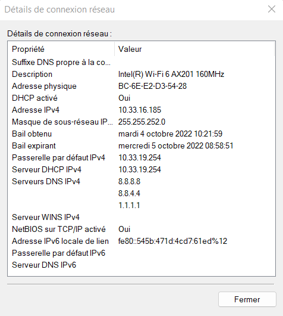

# I. Exploration locale en solo
## 1. Affichage d'informations sur la pile TCP/IP locale
**🌞 Affichez les infos des cartes réseau de votre PC**
- nom, adresse MAC et adresse IP de l'interface WiFi
```
Description. . . . . . . . . . . . . . : Intel(R) Wi-Fi 6 AX201 160MHz
Adresse physique . . . . . . . . . . . : BC-6E-E2-D3-54-28
Adresse IPv4. . . . . . . . . . . . . .: 10.33.16.185
```
- nom, adresse MAC et adresse IP de l'interface Ethernet
```
Description. . . . . . . . . . . . . . : Realtek Gaming GbE Family Controller
Adresse physique . . . . . . . . . . . : 84-69-93-52-2E-D1
```
**🌞 Affichez votre gateway**

- utilisez une commande pour connaître l'adresse IP de la passerelle (ou *gateway*) de votre carte WiFi
```
Passerelle par défaut. . . . . . . . . : 10.33.19.254
```
**🌞 Déterminer la MAC de la passerelle**

- à l'aide d'une commande, affichez votre table ARP, et déterminez ainsi l'adresse MAC de la passerelle
```
10.33.19.254          00-c0-e7-e0-04-4e     dynamique
```
En utilisant l'interface graphique de votre OS :  

**🌞 Trouvez comment afficher les informations sur une carte IP (change selon l'OS)**

- trouvez l'IP, la MAC et la gateway pour l'interface WiFi de votre PC




## 2. Modifications des informations
### A. Modification d'adresse IP (part 1)
🌞 Utilisez l'interface graphique de votre OS pour **changer d'adresse IP** :
- changez l'adresse IP de votre carte WiFi pour une autre
- ne changez que le dernier octet
```
Adresse IPv4. . . . . . . . . . . . . .: 10.33.16.112
```
🌞 **Il est possible que vous perdiez l'accès internet.** Que ce soit le cas ou non, expliquez pourquoi c'est possible de perdre son accès internet en faisant cette opération.
J'ai bien Internet parce que je suis intelligent et j'ai trouvé une adresse ip non attribué.

# II. Exploration locale en duo

🌞 **Modifiez l'IP des deux machines pour qu'elles soient dans le même réseau**

🌞 **Vérifier à l'aide d'une commande que votre IP a bien été changée**
```
Adresse IPv4. . . . . . . . . . . . . .: 10.10.10.240
```

🌞 **Vérifier que les deux machines se joignent**
```Envoi d’une requête 'Ping'  10.10.10.240 avec 32 octets de données :
Réponse de 10.10.10.110 : octets=32 temps=1 ms TTL=128
Réponse de 10.10.10.110 : octets=32 temps=2 ms TTL=128
Réponse de 10.10.10.110 : octets=32 temps=1 ms TTL=128
Réponse de 10.10.10.110 : octets=32 temps=1 ms TTL=128
```
🌞 **Déterminer l'adresse MAC de votre correspondant**
```
Interface : 10.33.16.199 --- 0xa
  Adresse Internet      Adresse physique      Type
  10.10.10.110          bc-6e-e2-d3-54-28     dynamique
```


