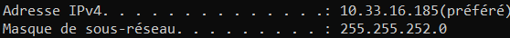

# I. Exploration locale en solo
## 1. Affichage d'informations sur la pile TCP/IP locale
**🌞 Affichez les infos des cartes réseau de votre PC**
- nom, adresse MAC et adresse IP de l'interface WiFi



- nom, adresse MAC et adresse IP de l'interface Ethernet


**🌞 Affichez votre gateway**

- utilisez une commande pour connaître l'adresse IP de la passerelle (ou *gateway*) de votre carte WiFi
```
Passerelle par défaut. . . . . . . . . : 10.33.19.254
```
